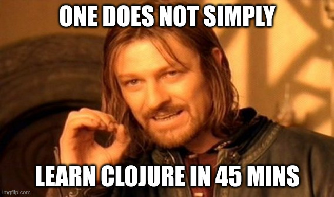

# **Clojure 101**

#### **Interactive Introduction**

Kostas Georgiadis

https://github.com/kongeor

---

# About me

- Senior Clojure Engineer
  * Mainly Java and Clojure
  * But also Javascript and Python
- Experience
  * POS systems, Analytics, Real estate, Marketing
  * Web services/API design
  * And also FE (react), infra (AWS), e2e testing (cypress)

---

# About you

- What is your primary language? Java? Javascript? Python? Other?
- How many years? 
  * < 2
  * [2, 5]
  * \> 5
- What do you do?
  * Web services/APIs? Frontends? Mobiles?
  * Other

---

# Clojure

- Created by Rich Hickey in 2007
- Dynamic and Functional
- Lisp
- Hosted, JVM

---

# About this talk

- Quacks like an intro
- REPL driven
- Concept oriented
- It's a trap!

---

# Agenda

1. hello world, syntax, REPL, basic functions
1. data structures, equality, values
1. loop/recur, lazy sequences, TCO, destructuring
1. polymorphism, protocols, host interop
1. example 1: log parsing
1. example 2: pattern matching, macros

--- 

# Lisp Cycles

https://xkcd.com/297/

---

---

# Lisp

https://xkcd.com/224/

---

# Where to go from here?

- https://clojure.org/reference/reader
- https://4clojure.oxal.org/
- https://www.braveclojure.com/clojure-for-the-brave-and-true/
- https://www.manning.com/books/the-joy-of-clojure-second-edition
- https://clojurians.slack.com/
- [Rich Hickey Talks youtube playlist](https://www.youtube.com/watch?v=YR5WdGrpoug&list=PLZdCLR02grLrEwKaZv-5QbUzK0zGKOOcr&index=1)

---

# Thank you!